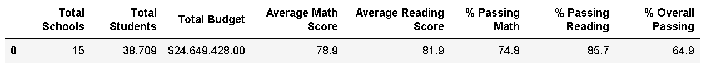

# School District Analysis

### Analysis

##### Overview of the school district analysis:

Because evidence of academic dishonesty. reading and math grades for Thomas High School ninth graders need to removed from the original school data set.   In order to uphold state-testing standards an analysis is to be performed on the altered data to identify what the impacts are to several key metrics that the school district keeps track of.  

##### Results:

This analysis was utilized to identify the follow information.

- The list and table below show how the change in the data impacted the district as a whole.

  - Average Math Scores changed from 79.0 to 78.9
- Average Reading scores remained unchanged at 81.9
  - % Passing Math changed from 75% to 74.8%
- % Passing Reading changed from 86% to 85.7%
  - % Overall Passing changed from 65% to 64.9%
- This table shows the most current scores.

* The only individual school affected by the data change was Thomas High School.
  * This table shows their scores before the data change

  * This table shows their current scores

- Dropping the ninth graders’ math and reading scores from the database effected Thomas High School’s negatively.  There student performance scores were lower than before.  The change in the data had no effect on the student performance scores at the other individual schools.

- The change was not significant enough the change any of the average scores in the follow:

  - Math and reading scores by grade
  - Scores by school spending
  - Scores by school size
  - Scores by school type

##### Summary:

The analysis showed that there was an impact to the overall percentages for the District and the averages and percentages for Thomas High School.

